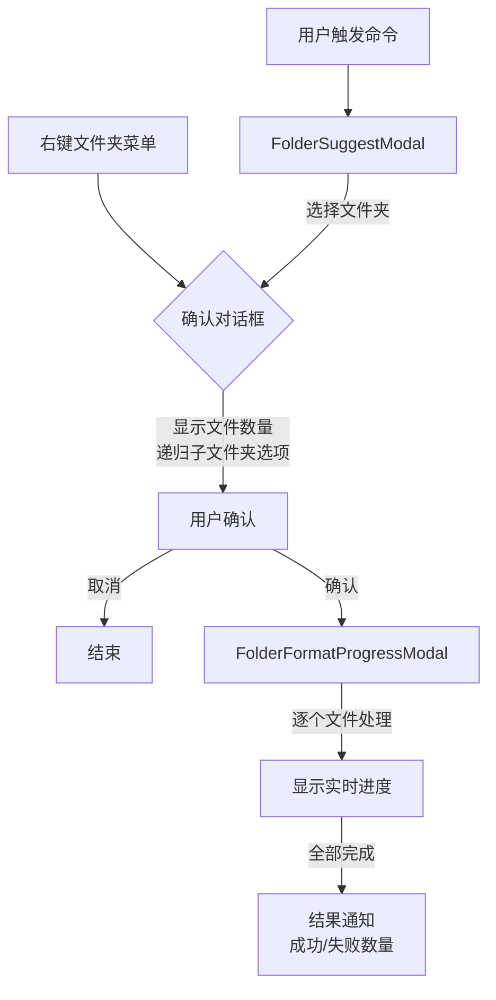

# 批量文件夹格式化功能设计

| 项 | 内容 |
|---|---|
| 创建日期 | 2026-05-04 |
| 状态 | 设计中 |
| 影响版本 | 1.2.0 |

## 问题定义

当前 `format-folder` 命令直接格式化整个 vault 的所有 Markdown 文件，存在以下问题：

1. **无法选择目标文件夹** — 用户只想格式化某个子文件夹时不可行
2. **缺乏操作确认** — 高风险操作没有二次确认，容易误操作
3. **无进度反馈** — 批量处理时用户不知道当前进度
4. **无排除机制** — 可能误格式化系统文件夹如 `.obsidian`

## 方案概述

增强批量格式化功能，提供：

- 文件夹选择对话框（支持搜索过滤）
- 文件浏览器右键菜单快捷操作
- 操作前确认（显示待处理文件数量）
- 实时进度显示（进度条 + 当前文件名）
- 内置常见文件夹排除

## 详细设计

### 1. 组件结构

```
src/
├── modals/
│   ├── FolderSuggestModal.ts       # 文件夹选择对话框
│   └── FolderFormatProgressModal.ts  # 格式化进度对话框
├── utils/
│   └── folderScanner.ts            # 文件扫描和过滤工具
└── main.ts                         # 注册命令和右键菜单
```

### 2. 核心流程



### 3. 组件设计

#### FolderSuggestModal

- 继承 Obsidian `FuzzySuggestModal<TFolder>`
- 列表显示 vault 中所有文件夹的完整路径
- 支持输入文本搜索过滤
- 选中后跳转到确认对话框

#### FolderFormatProgressModal

- 自定义 Modal，包含：
  - 进度条（已处理/总数，百分比）
  - 当前处理的文件名显示
  - 实时计数：已成功、已失败
  - 取消按钮（可选，第一阶段可不实现）
- 关闭时自动汇总结果

#### folderScanner 工具函数

```typescript
/**
 * 扫描文件夹下的所有 Markdown 文件
 * @param folder 根文件夹
 * @param recursive 是否递归子文件夹（默认 true）
 * @returns 符合条件的 TFile 数组
 */
export function scanMarkdownFiles(
  folder: TFolder,
  recursive?: boolean
): TFile[];
```

**内置排除规则**：
- 文件夹名以 `.` 开头的（`.obsidian`、`.git`、`.trash` 等）
- `node_modules` 文件夹
- 仅返回 `.md` 后缀的文件

### 4. 右键菜单集成

- 在 `onload` 中注册 `file-menu` 事件监听
- 仅对 `TFolder` 类型添加菜单项
- 菜单项文本：`格式化此文件夹`
- 点击后直接跳转到确认对话框（跳过文件夹选择）

### 5. 设置项

第一阶段不新增设置项，使用以下默认行为：

- 默认递归子文件夹
- 内置排除规则不可配置

未来可扩展：
- 默认是否递归的开关
- 自定义排除列表（glob 模式）

## 影响范围

- **新增文件**：3 个（2 个 Modal，1 个工具函数）
- **修改文件**：`src/main.ts`（注册命令和菜单）
- **无破坏性变更**：现有功能不受影响

## 测试计划

### 单元测试
- `folderScanner.test.ts`：测试文件扫描、排除逻辑、递归/非递归
- Modal 类不做单元测试（依赖 Obsidian 运行时）

### 手动测试
1. 命令面板调用 → 选择文件夹 → 确认 → 验证格式化结果
2. 右键文件夹菜单 → 确认 → 验证格式化结果
3. 非递归选项验证
4. 排除文件夹验证（.obsidian 内的文件不应被处理）

## 实施步骤

1. 创建 `folderScanner.ts` 工具函数及测试
2. 创建 `FolderSuggestModal.ts`
3. 创建 `FolderFormatProgressModal.ts`
4. 修改 `main.ts` 集成新流程
5. 添加右键菜单支持
6. 手动测试和 bug 修复
